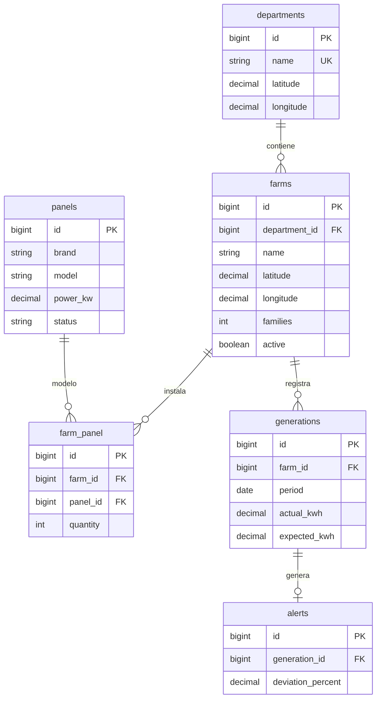

# Diagrama relacional

Restricciones únicas: departments.name; farm_panel(farm_id, panel_id); generations(farm_id, period); alerts.generation_id. Las tablas con escritura tienen timestamps, excepto la tabla pivote. users mantiene credenciales con hash. La capacidad, CO₂ y proyecciones se derivan, evitando duplicar valores que podrían desactualizarse.
